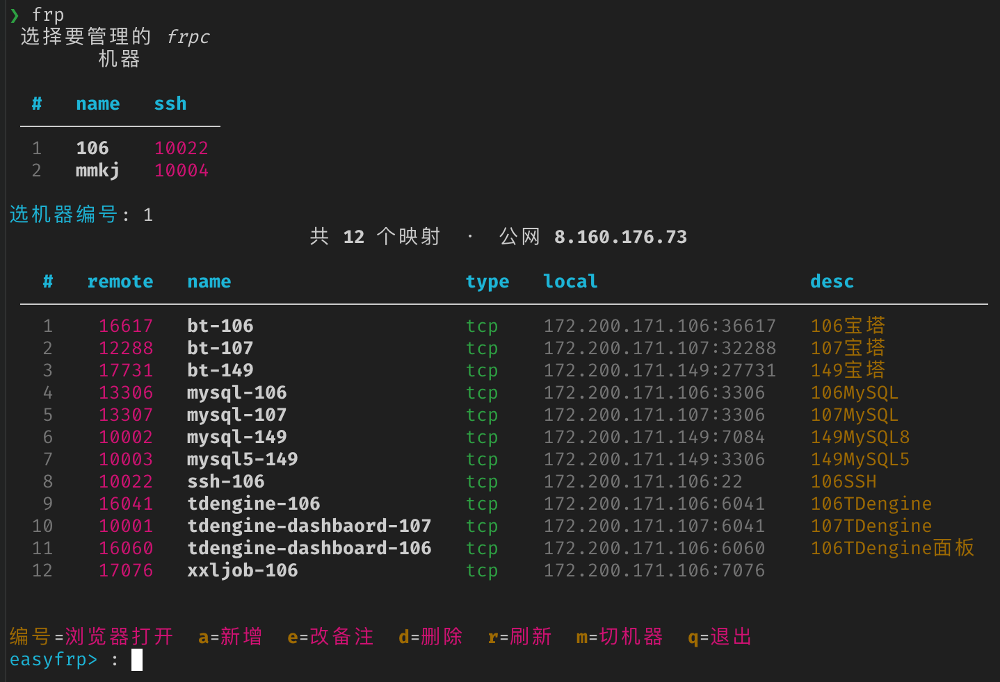

# EasyFrp

多台内网机器 frp 穿透的**一键部署** + 本地**交互式管理**工具。

[](LICENSE)

- 列表里按编号回车即浏览器打开服务，增删/改备注全交互
- 自动查重、自动分配端口，并规避 frps 上已被占用的端口
- 服务端 / 客户端各一条命令装好，所有 IP / token / 端口参数化

## 截图

| 选择机器 | 映射管理 |
| :---: | :---: |
|  |  |

| 服务端安装 | 客户端安装 |
| :---: | :---: |
|  |  |

## 快速开始

### 1. 服务端（公网服务器）

```bash
curl -fsSL https://gh-proxy.org/https://raw.githubusercontent.com/minivv/EasyFrp/main/install-frps.sh | bash
```

记下打印的 `auth.token`。默认安装公网需放行的端口：

| 端口 | 用途 | 建议 |
| ---- | ---- | ---- |
| `7000/tcp` | frp 通信 | 公网放行 |
| `7500/tcp` | dashboard | 仅管理 IP |
| `10000-20000/tcp` | 映射端口范围 | 按需放行 |

### 2. 客户端（每台内网机器）

**Linux / macOS：**

```bash
curl -fsSL https://gh-proxy.org/https://raw.githubusercontent.com/minivv/EasyFrp/main/install-frpc.sh | bash -s -- --server-addr <公网IP> --token <上一步的token>
```

**Windows（PowerShell）：**

```powershell
irm https://gh-proxy.org/https://raw.githubusercontent.com/minivv/EasyFrp/main/install-frpc.ps1 -OutFile frpc.ps1
Set-ExecutionPolicy -Scope Process Bypass -Force
./frpc.ps1 -ServerAddr <公网IP> -Token <上一步的token>
```

自动探测空闲端口作为本机 ssh 远程端口，装完打印一段 `[[machines]]` 配置。

### 3. 本机管理工具（在你自己电脑上装）

**第 1 步，先下载代码：**

```bash
git clone https://github.com/minivv/EasyFrp.git
cd EasyFrp
```

（没有 git 就在 GitHub 页面点 `Code → Download ZIP` 解压，然后 `cd` 进去。）

**第 2 步，装依赖**（只需一次，装在独立目录里，不碰系统 Python）：

```bash
python3 -m venv ~/.local/share/easyfrp/venv
~/.local/share/easyfrp/venv/bin/pip install rich prompt_toolkit
```

**第 3 步，建配置文件：**

```bash
mkdir -p ~/.config/easyfrp
cp config.example.toml ~/.config/easyfrp/config.toml
```

用编辑器打开 `~/.config/easyfrp/config.toml`，改两处：
- `[frps]` 里的 `host` → 你的公网 IP
- 把每台内网机器装完后 `install-frpc` 打印的 `[[machines]]` 片段粘进去

**第 4 步，建个 `frp` 命令**（`~/EasyFrp` 换成你第 1 步的目录）：

```bash
mkdir -p ~/.local/bin
cat > ~/.local/bin/frp <<'EOF'
#!/bin/sh
exec "$HOME/.local/share/easyfrp/venv/bin/python" "$HOME/EasyFrp/easyfrp.py" "$@"
EOF
chmod +x ~/.local/bin/frp
```

> 如果敲 `frp` 提示找不到命令，把 `export PATH="$HOME/.local/bin:$PATH"` 追加到 `~/.zshrc`（zsh）或 `~/.bashrc`（bash），再重开终端。

**第 5 步，使用：**

```bash
frp            # 选机器 → 进入映射管理
frp -m 106     # 直接指定机器名
```

管理命令：`编号`=浏览器打开、`a`=新增、`e`=改备注、`d`=删除、`m`=切机器、`r`=刷新、`q`=退出。

## 卸载

删除服务、删除目录都会逐步 `y` 确认：

```bash
# frps（Linux）
curl -fsSL https://gh-proxy.org/https://raw.githubusercontent.com/minivv/EasyFrp/main/install-frps.sh | bash -s -- --uninstall

# frpc（Linux / macOS）
curl -fsSL https://gh-proxy.org/https://raw.githubusercontent.com/minivv/EasyFrp/main/install-frpc.sh | bash -s -- --uninstall
```

```powershell
# frpc（Windows）
./frpc.ps1 -Uninstall
```

## 支持范围

| | Linux (systemd) | macOS | Windows |
|---|---|---|---|
| frps 服务端 | ✅ | 手动 | 手动 |
| frpc 内网机 | ✅ | ✅ (launchd) | ✅ (计划任务) |
| 管理工具 | ✅ | ✅ | ✅ |

> - Linux 部署脚本支持 `x86_64` / `arm64` 且带 systemd 的发行版（Ubuntu/Debian/CentOS/Fedora/Rocky 等）。
> - 管理工具在 Windows 上只需装 Python 3.11+ 与 `pip install rich prompt_toolkit`；访问命令会自动用 `start` 打开浏览器（见配置里的 `{open}` 占位符）。

## 配置

```toml
[frps]
host = "公网IP"            # frps 地址
ssh_port = 22              # frps 所在机器 ssh 端口（探测端口占用用）
user = "root"
key = "~/.ssh/id_rsa"
port_range = [10000, 20000]

[commands]                 # 访问命令模板，占位符 {host} {port} {name} {desc} {key} {user}
tcp = "open http://{host}:{port}"

[[machines]]               # 每台 frpc 机器一条
name = "106"
ssh_port = 10022
proxies_dir = "/www/server/frp/proxies"
frpc_toml = "/www/server/frp/frpc.toml"
# 每台机器可单独覆盖上面的全局项：
# user        = "root"                # 覆盖 [frps] 的 user
# key         = "~/.ssh/id_ed25519"   # 覆盖 [frps] 的 key（不同机器可用不同密钥）
# restart_cmd = "nohup sh -c 'sleep 1; systemctl restart frpc' >/dev/null 2>&1 &"
```

每台机器都能用下面的键覆盖 `[frps]` 里的同名项：`user`、`key`；此外还有 `restart_cmd`（默认就是上面那条 nohup 重启命令）。

## License

[MIT](LICENSE)